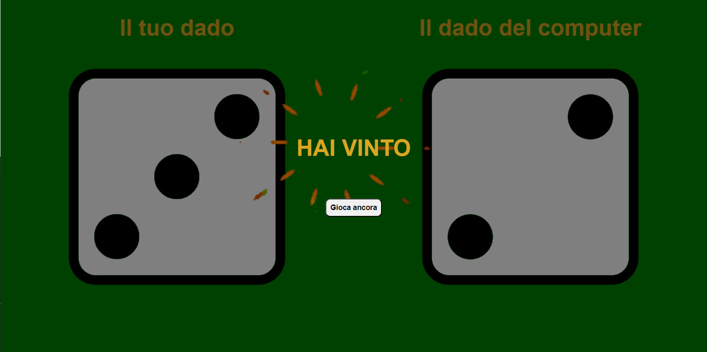

Il progetto consiste in un semplice gioco dei dadi implementato utilizzando HTML, CSS e JavaScript. Il gioco prevede il lancio di due dadi, uno per il giocatore e uno per il computer, e determina il vincitore in base al valore ottenuto.
Il gioco implementa due semplici animazioni durante il lancio dei dadi e dei fuochi di artificio in caso di vittoria.

link

## Schermata iniziale

## Schermata in caso di vittoria

## Schermata in caso di pareggio

## Schermata n caso di sconfitta

